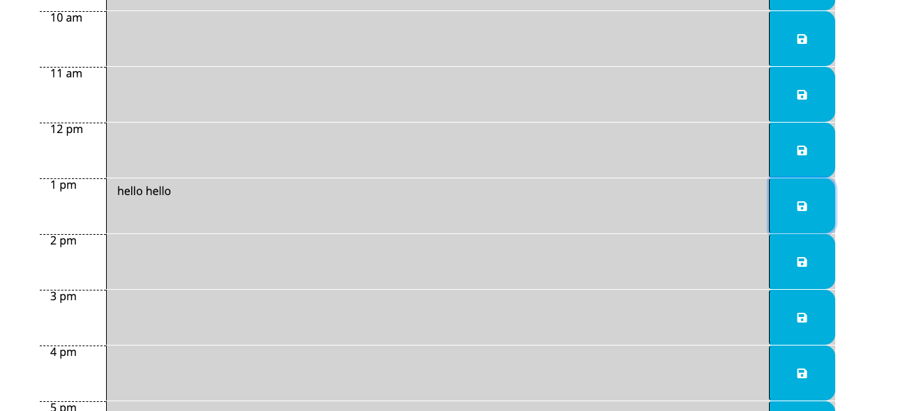

# Work-Day-Scheduler

Here is the link for the hopefully successfuly deployed website!
https://brandpower.github.io/Work-Day-Scheduler/

For this week I attempted to build a work day scheduler. It shows the hours between 9 and 5 with corresponding colour depending on the time of day. 

Below is a screenshot that was taken after 5pm so everything is grey. 

